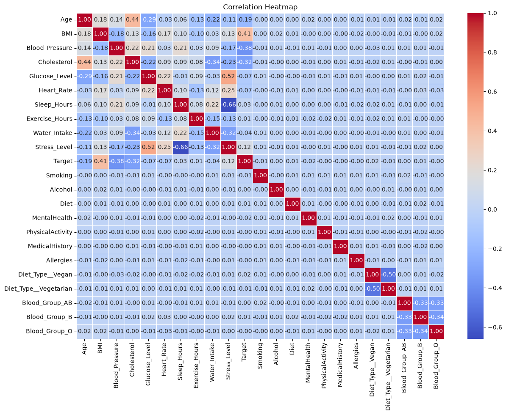
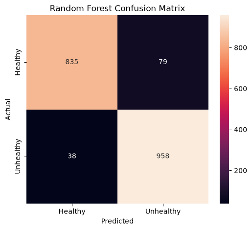

# NovaGen Research Labs — Health Risk Classification

A supervised machine learning project that classifies individuals as **Healthy** or **Unhealthy** using demographic, physiological, lifestyle, and medical-history indicators.

## Objective

Build a classification model to identify individuals who may be at higher health risk based on available health-related features.

The model can support:

- Participant selection for clinical trials and longitudinal studies
- Population stratification for risk-based health analysis

## Dataset

The dataset contains health records with features covering:

- Demographic information
- Physiological measurements
- Lifestyle factors
- Mental and physical health indicators
- Medical history and allergies
- Diet type and blood group

**Target:** `Target`

- `0` → Healthy
- `1` → Unhealthy

The dataset used in the project contains **9,549 records and 23 columns**.

## Approach

- Performed initial data inspection and exploratory data analysis
- Analyzed target distribution and relationships between important health indicators
- Used an **80/20 stratified train-test split**
- Applied **StandardScaler** using a `ColumnTransformer`
- Built individual pipelines for multiple classification models
- Evaluated baseline performance using Accuracy, Precision, Recall, and F1-score
- Applied **GridSearchCV with 5-fold cross-validation** for hyperparameter tuning
- Compared tuned models on the unseen test set
- Built a **Soft Voting Classifier** using the tuned models
- Selected the final model based on predictive performance

## Models

### Logistic Regression

Used as a simple and interpretable baseline classification model.

### KNN

Used as a distance-based classifier to capture similarity between health profiles.

### Random Forest

Used as a tree-based ensemble based on **bagging**, providing strong performance while capturing nonlinear relationships and feature interactions.

### AdaBoost

Used as a **boosting** approach that sequentially combines weak learners to improve predictive performance.

### Soft Voting Classifier

Combines predictions from the tuned **Random Forest, KNN, and AdaBoost** models to evaluate whether an ensemble of different learning approaches can outperform individual models.

## Exploratory Data Analysis

### Correlation Heatmap

The correlation heatmap provides an overview of relationships between numerical health indicators and the target variable.



## Results

| Model | F1 Score |
|---|---:|
| Logistic Regression | 82.24% |
| KNN | 90.87% |
| **Random Forest** | **94.25%** |
| AdaBoost | 84.76% |
| Voting Classifier | 93.08% |

### Hyperparameter Tuning

**Random Forest**

```
max_depth = 20
min_samples_leaf = 1
min_samples_split = 2
n_estimators = 200
```

Best CV F1 = 0.9401

**KNN**

```
metric = manhattan
n_neighbors = 15
weights = distance
```

Best CV F1 = 0.9000

**AdaBoost**

```
learning_rate = 0.5
n_estimators = 400
```

Best CV F1 = 0.8492

## Final Model

**Random Forest** was selected as the final model.

- Accuracy: 93.87%
- Precision: 92.38%
- Recall: 96.18%
- F1 Score: 94.25%

The high recall is particularly useful for identifying individuals belonging to the Unhealthy class.

### Confusion Matrix

The final Random Forest confusion matrix shows the model's correct and incorrect classifications across the Healthy and Unhealthy classes.



## Key Takeaways

- Random Forest achieved the strongest overall performance among the evaluated models.
- KNN showed a substantial improvement after hyperparameter tuning.
- AdaBoost improved slightly but remained below Random Forest and KNN.
- The Voting Classifier achieved strong performance but did not outperform the tuned Random Forest.
- Hyperparameter tuning helped improve some models, while Random Forest was already highly effective in its baseline configuration.

## Technologies

Python • Pandas • NumPy • Matplotlib • Seaborn • Scikit-learn • StandardScaler • ColumnTransformer • Pipeline • Logistic Regression • KNN • Random Forest • AdaBoost • Voting Classifier • GridSearchCV

## Project Structure

```
NovaGen/
├── README.md
├── novagen.ipynb
├── .gitignore
└── images/
    ├── confusion_matrix.png
    └── correlation_heatmap.png
```