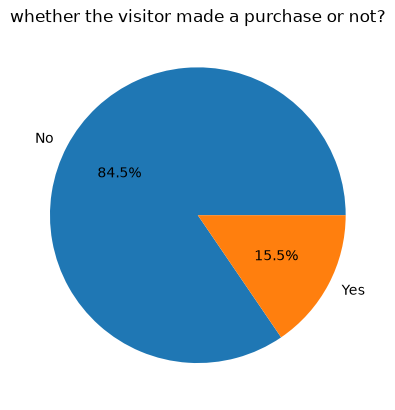
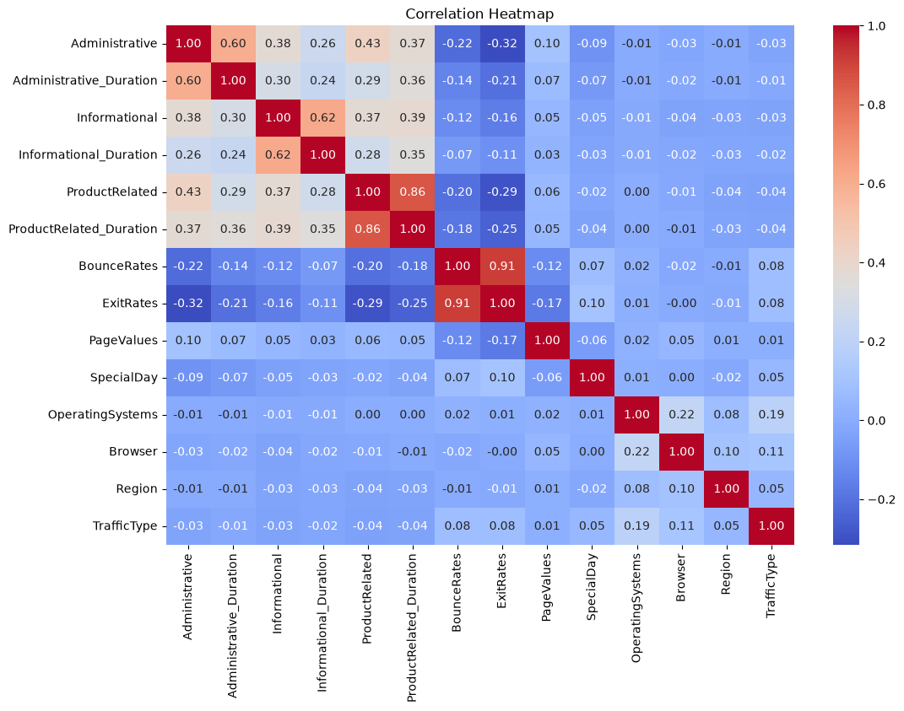

# ShopSmart – Purchase Prediction

A supervised machine learning project that predicts whether an e-commerce visitor is likely to make a purchase based on browsing behaviour and session characteristics.

## Objective

Build a **Decision Tree classification model** to predict the `Revenue` outcome.

Since the target is imbalanced, **F1-score** is used as the primary evaluation metric, with **0.55** as the benchmark.

## Dataset

The dataset contains **12,330 user sessions** with numerical and categorical features related to visitor and browsing behaviour.

**Target:** `Revenue` — whether the visitor completed a purchase.

## Approach

- Performed initial data inspection and exploratory data analysis
- Examined target class distribution and behavioural patterns
- Applied an **80/20 stratified train-test split**
- Used `ColumnTransformer` with **One-Hot Encoding** for categorical features
- Built a `Pipeline` combining preprocessing and a **Decision Tree Classifier**
- Evaluated the baseline using Accuracy, Precision, Recall, F1-score, classification report, and confusion matrix
- Used **5-fold GridSearchCV** with F1-score for hyperparameter tuning
- Applied **cost-complexity pruning** using `ccp_alpha`
- Evaluated the final model on the unseen test set

## Exploratory Data Analysis

### Target Variable Distribution

The target distribution shows the class balance of the `Revenue` variable and highlights the class imbalance considered during model evaluation.



### Correlation Heatmap

The correlation heatmap provides an overview of relationships between the numerical features and helps identify potentially relevant relationships with the target variable.



## Model

### Decision Tree Classifier

A **Decision Tree Classifier** was used as the main predictive model.

Class imbalance was handled using:

```python
class_weight="balanced"
```

### Hyperparameters Tuned

- `max_depth`
- `min_samples_split`
- `min_samples_leaf`
- `ccp_alpha`

## Results

### Baseline

| Metric | Score |
|---|---|
| Accuracy | 85.24% |
| Precision | 52.47% |
| Recall | 50.00% |
| F1-score | 0.5121 |

### Tuned & Pruned

**Best Parameters:**

```
max_depth = 3
min_samples_split = 2
min_samples_leaf = 1
ccp_alpha = 0.01
```

Cross-validation F1: 0.6667

**Test Performance:**

| Metric | Score |
|---|---|
| Accuracy | 86.90% |
| Precision | 55.49% |
| Recall | 78.01% |
| F1-score | 0.6485 |

### Improvement

```
Baseline F1      : 0.5121
Tuned/Pruned F1  : 0.6485
Benchmark        : 0.5500
```

The final model achieved an absolute F1-score improvement of 0.1364 over the baseline and exceeded the required benchmark.

## Final Model

The tuned and pruned Decision Tree Classifier was selected as the final model.

### Confusion Matrix

The confusion matrix shows the final model's correct and incorrect predictions for the two classes.

## Key Takeaways

- The baseline Decision Tree achieved an F1-score of 0.5121.
- Hyperparameter tuning and cost-complexity pruning improved the F1-score to 0.6485.
- The final model exceeded the required 0.55 F1 benchmark.
- Pruning with `ccp_alpha = 0.01` and limiting the tree to `max_depth = 3` produced the selected configuration.
- The final model achieved a 78.01% recall, improving its ability to identify positive purchase outcomes.

## Technologies

Python • Pandas • NumPy • Matplotlib • Seaborn • Scikit-learn • Decision Trees • GridSearchCV • One-Hot Encoding • Pipeline • ColumnTransformer

## Project Structure

```
ShopSmart/
├── README.md
├── ShopSmart.ipynb
├── .gitignore
└── images/
    ├── target_distribution.png
    ├── correlation_heatmap.png
    └── confusion_matrix.png
```