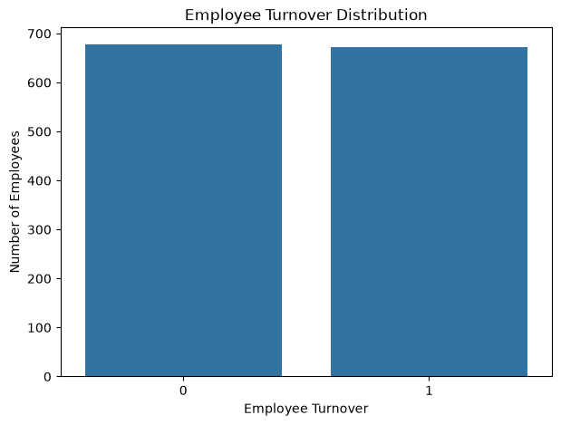
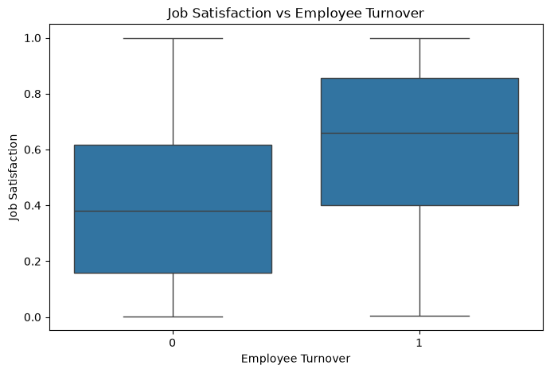
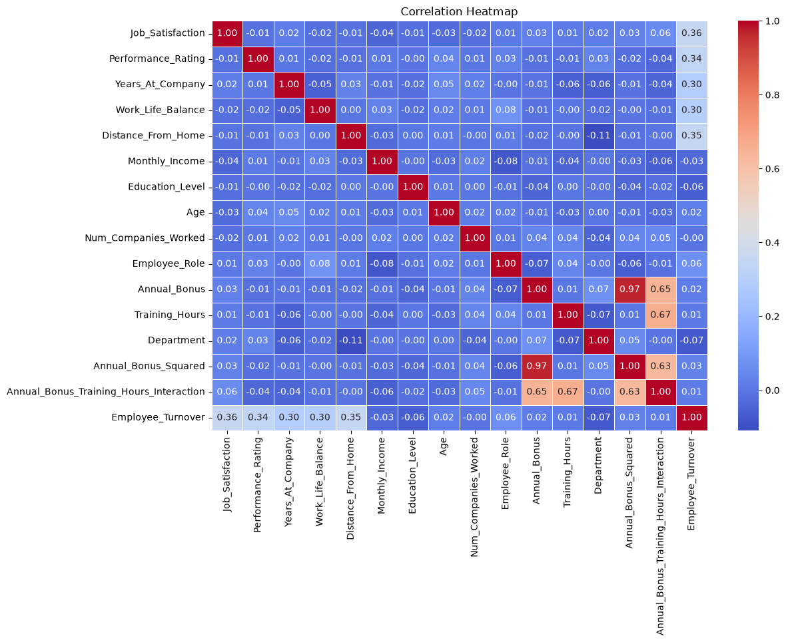
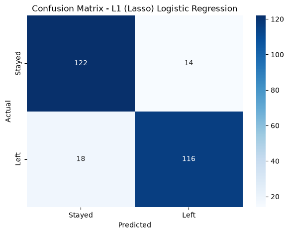

# Employee Turnover Prediction

A machine learning project that predicts whether an employee is likely to leave an organization using **Logistic Regression** and regularization techniques.

## Objective

Build a classification model to predict **employee turnover** and compare the effect of **L1 (Lasso)** and **L2 (Ridge)** regularization on model performance.

## Workflow

1. Data loading and inspection
2. Feature and target separation
3. Stratified train-test split
4. Exploratory Data Analysis
5. Baseline Logistic Regression
6. L1 (Lasso) regularization
7. L2 (Ridge) regularization
8. Model evaluation using accuracy, precision, recall, and F1-score
9. Confusion matrix analysis

## Exploratory Data Analysis

### Employee Turnover Distribution



### Job Satisfaction vs Employee Turnover



### Correlation Heatmap



## Models

Three Logistic Regression configurations were evaluated:

- **Baseline Logistic Regression**
- **L1 (Lasso) Regularization**
- **L2 (Ridge) Regularization**

## Results

| Model | Accuracy |
|---|---:|
| Baseline Logistic Regression | 85.93% |
| **L1 (Lasso)** | **87.04%** |
| L2 (Ridge) | 85.93% |

**L1 (Lasso) regularization achieved the highest test accuracy of 87.04%.**

## Confusion Matrix

The confusion matrix below shows the classification performance of the final **L1 (Lasso) Logistic Regression** model on the test set.



## Key Takeaway

L1 regularization produced the best test accuracy among the evaluated Logistic Regression models, improving performance over the baseline model.

## Tools & Technologies

- Python
- Pandas
- NumPy
- Matplotlib
- Seaborn
- Scikit-learn
- Jupyter Notebook

## Project Structure

```text
employee-turnover/
│
├── employee_turnover_project.ipynb
├── .gitignore
├── README.md
└── images/
    ├── turnover_distribution.png
    ├── job_satisfaction_vs_turnover.png
    ├── correlation_heatmap.png
    └── confusion_matrix.png