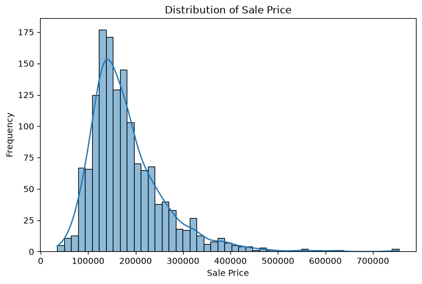
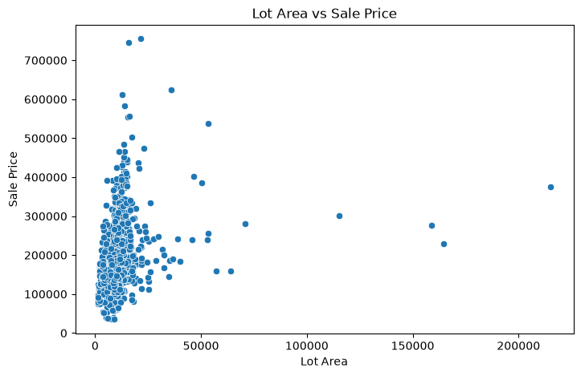
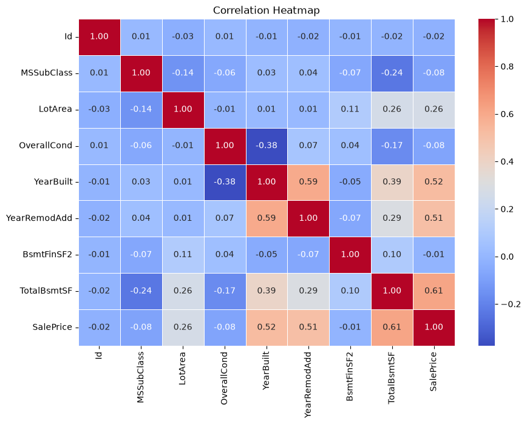

# House Price Prediction

A machine learning project that predicts **house sale prices** using **Linear Regression**, with data cleaning, exploratory data analysis, categorical encoding, and regression evaluation.

## Objective

Build a regression model that predicts house sale prices based on available property characteristics and evaluate its performance using standard regression metrics.

## Dataset

The project uses the **House Price Prediction** dataset containing property-related features such as:

- Lot Area
- Overall Condition
- Year Built
- Year Remodeled
- Basement Area
- Building Type
- Zoning
- Exterior Features

The target variable is **`SalePrice`**.

## Workflow

1. Data loading and inspection
2. Initial data understanding
3. Data cleaning
4. Exploratory Data Analysis
5. Train-test splitting
6. Categorical feature encoding
7. Linear Regression model training
8. Model evaluation

## Exploratory Data Analysis

The analysis includes:

- Distribution of house sale prices
- Relationship between lot area and sale price
- Correlation between numerical features

### Sale Price Distribution



### Lot Area vs Sale Price



### Correlation Heatmap



## Model

**Linear Regression**

Categorical features were converted into numerical representations using one-hot encoding before model training.

## Results

| Metric | Score |
|---|---:|
| R² | 0.6195 |
| Adjusted R² | 0.5708 |
| MAE | 34,122.85 |
| RMSE | 54,022.75 |

The model achieved an **R² score of 0.6195**, indicating that it explains approximately 61.95% of the variation in house sale prices on the test set.

## Tools & Technologies

- Python
- Pandas
- NumPy
- Matplotlib
- Seaborn
- Scikit-learn
- Jupyter Notebook

## Project Structure

```
house-price-prediction/
│
├── house-price-prediction.ipynb
├── .gitignore
├── README.md
└── images/
    ├── saleprice_distribution.png
    ├── lotarea_vs_saleprice.png
    └── correlation_heatmap.png
```

## Conclusion

This project demonstrates an end-to-end regression workflow, covering data inspection, cleaning, exploratory analysis, categorical encoding, model training, and evaluation using multiple regression metrics.